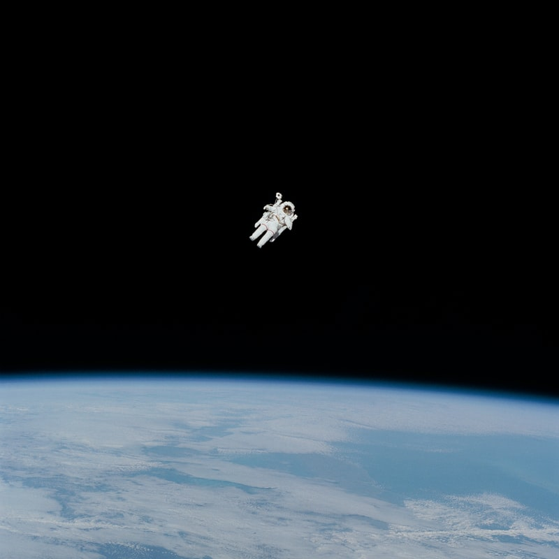

<!--StartFragment-->

Since 1984 the United States Congress passed a law that allowed for private space travel, this was  in the hopes space innovation would continue with less government spending. Athough we have seen advancements increase in innovative tech from affordable satellite launches to space x's StarLink. The level of funding invested in the industry is no where near what it should be considering the benefits it would have globally. 

Often when we hear of investing in space we immediately think of wasted money on sending people to float around in space for a while. Yet the truth is far from it. There is so much more going on in the space industry than just throwing money into space. So here are 10 reasons we should all be investing more into the space industry.

1. **The two Richest people in the world are**

    If you are money motivated, then the fact that the two richest people in the world (Elon Musk and Jeff Bezos) are investing heavily into space, should be a giveaway to the monetary value of investing. Space X’s StarLink project alone has been valued at[ $100 Billion by Morgan Stanley ](https://www.forbes.com/sites/daviddawkins/2020/10/23/elon-musks-spacex-gets-bullish-100-billion-valuation-from-morgan-stanley-double-what-investors-said-it-was-worth-in-august/?sh=76e6f10c6e79)as a base case and in a bullish market, it could be worth over $200 billion. Blue Origin also plans to launch its constellation as part of the[ Kuiper broadband project.](https://techcrunch.com/2020/12/16/amazons-project-kuiper-will-seek-multiple-launch-providers-to-carry-its-satellites-to-space/?guccounter=1&guce_referrer=aHR0cHM6Ly93d3cuZ29vZ2xlLmNvbS8&guce_referrer_sig=AQAAACsDh2cDA4q1bEmTUe1A-PyUbrsnOppgLa4Xjtj__Kox4HjDj52p29oHyFwXT12ENSNquo7PTscqpbUjZIS1k5ekavSHIxJw6NKFmMHNv3aA7keooE08YwwNjiosQDkU6AeDgauBOXvTvT2Dt5L4_7GzmRBkG90OyHotG4EmmHCS) With the likes of Virgin Galactic's recent IPO and Virgin Orbit likely to join, as well as Ark investments soon to create a Space ETF. It's only a growing industry and now is better than ever to invest.
2. **Create More Jobs** 

   Nasa alone employs 8000 people, this doesn't even account for people employed at the likes Boeing and other manufactures who provide goods and services to Nasa. [Morgan Stanley](mgstn.ly/3bK0SDU) estimates that the space industry may grow to more than $1 trillion of the USA’s GDP by 2040. 
3. **Cut Global Warming on Earth**

   As a space fanatic, one of the most irritating things to hear is why would we invest in space when we should invest in saving the Earth First. This question is always asked as if they both can't coincide. For example, [solar panels in space](https://www.greenmatch.co.uk/blog/2020/02/space-based-solar-power) create up to 40 times more electricity than solar panels on earth. 

   If we could move big carbon-producing factories, power stations and even farming to space. We would be able to dramatically cut our carbon emissions. With the rapid innovation in robotics and AI the reality of being able to do this isn’t that far away, all that's needed is some real governmental and public investment into the industry. 
4. **Incentivise Higher Education**

   We all know that higher education correlates with a strong economy. When Nasa had the shuttle Program, arguably millions of kids were inspired to become Astronauts or scientists. The value of what the shuttle program had on the young minds of the world is unquestionable. Right now a lot of young minds feel deflated and caught up in the crisis of social media and the corona virus. 
5. **Give The World Hope** 

   Similarly to my last point, programs such as Nasa’s Shuttle program inspired billions worldwide, it gave people hope and motivation to keep going. We can see something similar happening today with the likes of Space X and the hoards of fans that Elon Musk is accumulating along the way. It could even help save the [new lost generation](https://www.theatlantic.com/ideas/archive/2020/04/millennials-are-new-lost-generation/609832/).
6. **Unite Nations In Troubling Times**

   With the recent rise in global political divide leading to some tense relationships, we could use a global initiative to unite us. The ISS saw cooperation between two countries that were close to nuking each other. Science doesn't care about politics, it cares about funding, cooperation and results. Therefore, the more global power the space industry has, the more it can persuade and lobby governments to work together. 
7. **Expand Our knowledge**

   We liveon a floating space rock, in an endless space of other floating space rocks with floating giant fireballs. There are still so many questions to be answered, what is dark matter? What are black holes? What was before the Big Bang? Is there extra-terrestrial life? I don't know about you, but I would love to have some answers in my lifetime and without enough investment, it’s unlikely to happen.
8. **Rid The World Of Poverty**

   Now this one may seem a little far fetched, but it would be a result of all previous reasons. If we moved the industry to space, there is a good chance it would be largely operated by AI. We would no longer need to exploit poorer states for cheap labour if we can get it done safer, cheaper and greener in space. We would also have more resources and time to concentrate on removing poverty. Most poverty is a direct result of poor education and basic resources. The issue of poverty isn't a hard one to solve, it just benefits our current economies to keep poverty alive.
9. **Save The Turtles**

   Investing in space isn't just investing in space. It's investing in science, innovation and the future. Almost anyone you meet in the space industry wants to make the world a better place. The technology required for space innovation is ground-breaking stuff and as such will create many technologies that can be harnessed here on earth. Cleaning up the sea of plastic for example will become a breeze in comparison. Although, if you really want to save the turtles I would advise donating to [the Ocean Clean Up](https://theoceancleanup.com/about/) first.
10. **Space Is exciting**

    The final, but most important reason that pushes me to invest is that Space is exciting. I love sci-fi, from Stargate to Star Trek to Star Wars. Any space tv series you can think of created in the last 15 years, I have probably watched it. Space exploration gives a sense of wonder and unknowingness of outcomes that I find exciting. I currently hold many shares in [Virgin Galactic ](https://www.virgingalactic.com/)because I want the company to succeed. The idea of commercial space travel excites me and for that reason, it outweighs the sense of risk that I should probably have in such an investment. 

<!--EndFragment-->